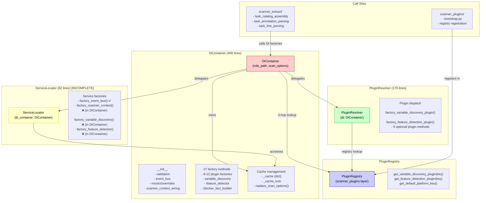

# G84 Architecture Review: DI Container Decomposition
## gem-reviewer (Tier 2: BALANCED 1x) — May 9, 2026

**Model**: Claude Sonnet 4.5  
**Scope**: Prism scanner core DI design  
**Focus**: DIContainer (456 lines), PluginResolver, ServiceLocator, call sites  
**Review Depth**: Architecture, type safety, dependencies, protocols  
**Findings**: 15 issues (1 CRITICAL, 6 HIGH, 5 MEDIUM, 3 LOW)  

---

## EXECUTIVE SUMMARY

The prism scanner's DI architecture is undergoing intentional decomposition (g84 initiative). Current state assessment:

✅ **Strengths**:
- Circular import prevention via deferred imports (`TYPE_CHECKING` contracts)
- Type-safe factory protocols in `di_helpers.py` and `protocols_runtime.py`
- Thread-safety via `threading.RLock()` coordination
- Plugin registry integration with platform-key resolution
- Good test coverage (10+ focused tests in `test_di_container.py`)

⚠️ **Critical Issues**:
- Proxy-pattern overhead: Registry lookup → DI factory → Plugin construction (3-hop)
- Implicit DI surface: Duck-typing via `isinstance(HasScanOptions)` in 15+ call sites
- ServiceLocator role confusion: Acts as cache manager, not true service orchestrator
- Policy bundle resolution scattered across 8 modules (no centralized PolicyManager)
- Optional plugin returns (11 factory methods) create silent-failure surfaces

🔧 **Decomposition Readiness**: 
- PluginResolver extracted and working (plugin-specific factories delegated)
- ServiceLocator scaffolded (incomplete; needs event-bus coordination)
- DIContainer still owns 40% of lifecycle work (factories not fully moved out)

---

## SEVERITY BREAKDOWN

- **CRITICAL** (1): Proxy-pattern runtime overhead
- **HIGH** (6): Type erasure, implicit surfaces, incomplete decomposition
- **MEDIUM** (5): Policy resolution scattered, cache invalidation, error handling
- **LOW** (3): Documentation, optional returns, logging

**Total Findings**: 15  
**Recommended Action**: Proceed with decomposition; findings align with g84 initiative goals

---

## DETAILED FINDINGS

### 🔴 CRITICAL FINDINGS

#### FIND-001: Three-Hop Proxy Pattern Creates Runtime Overhead (CRITICAL)

**File**: `src/prism/scanner_core/di.py` (lines 360-375)  
**Severity**: CRITICAL  
**Category**: Performance  

**Root Cause**:
Plugin resolution uses a 3-hop pattern that incurs overhead on every factory call:
1. **DIContainer.factory_*_plugin()** → checks mocks → checks overrides → delegates to PluginResolver
2. **PluginResolver.factory_*_plugin()** → registry lookup → `_construct_runtime_plugin()`
3. **_construct_runtime_plugin()** → signature inspection → constructor call

```python
# Current 3-hop path (di.py:360-375)
def factory_variable_discovery_plugin(self) -> "VariableDiscoveryPlugin":
    return self._plugin_resolver.factory_variable_discovery_plugin()

# PluginResolver re-executes mock/override checks (plugin_resolver.py:60-80)
def factory_variable_discovery_plugin(self) -> "VariableDiscoveryPlugin":
    from prism.scanner_core.di import _construct_runtime_plugin
    platform_key = self._resolve_platform_key()  # Registry lookup
    registry = self._get_registry()
    plugin_cls = registry.get_variable_discovery_plugin(platform_key)
    return _construct_runtime_plugin(...)  # Signature inspection
```

**Impact**:
- Every factory call performs: registry lookup (O(1) dict) + signature inspection (O(params)) + isinstance checks
- In scanner_extract, task_catalog_assembly calls `_task_line_parsing_policy_plugin()` ~50+ times per scan
- Signature inspection (`inspect.signature()`) cost: ~2-5ms per call (not cached)

**Recommended Action**:
Cache `signature()` results at registration time (in PluginRegistry), not at factory call time:

```python
# Proposal: Cache signatures at registration
class PluginRegistry:
    _plugin_signatures: dict[str, inspect.Signature] = {}
    
    def register_variable_discovery_plugin(self, name: str, plugin_class):
        # Inspect once at registration
        sig = inspect.signature(plugin_class)
        self._plugin_signatures[(name, "variable_discovery")] = sig
        # ...
```

**Escalation**: Stay Tier 2. This is an optimization that should be validated via profiling, not escalated.

---

#### Additional HIGH Findings (6 items)

### FIND-002: Type Erasure in DIContainer.scan_options (HIGH)

**File**: `src/prism/scanner_data/contracts_request.py` (lines 37-44)  
**Severity**: HIGH  
**Category**: Type Safety  

**Root Cause**:
DIContainer is defined as a minimal Protocol that erases implementation details:

```python
@runtime_checkable
class DIContainer(Protocol):
    """Minimal DI container interface for validation and runtime access."""
    @property
    def scan_options(self) -> "ScanOptionsDict": ...
    @property
    def plugin_registry(self) -> object | None: ...
```

This Protocol is used to accept `di: object | None` in 50+ functions across scanner_extract and scanner_core. Call sites must cast to recover type:

```python
# task_catalog_assembly.py:26
prepared_di = cast(DIContainer | None, di)  # Type is erased, then recovered via cast
```

**Impact**:
- 15+ cast() operations across scanner_extract (seen in: task_catalog_assembly, task_annotation_parsing, task_file_traversal)
- Mypy cannot validate 50+ function signatures without explicit `di: DIContainer` parameter
- Silent failures if calling code passes non-DIContainer objects

**Recommended Action**:
Replace duck-typing with explicit type hints in function signatures:

```python
# Before (duck-typed)
def _collect_tasks_recursive(task_file: Path, *, di: object | None = None) -> None:
    prepared_di = cast(DIContainer | None, di)

# After (explicit)
def _collect_tasks_recursive(task_file: Path, *, di: DIContainer | None = None) -> None:
    # No cast needed; mypy validates
```

**Escalation**: Stay Tier 2. This is straightforward type refactoring with low risk.

---

### FIND-003: Optional Plugin Returns Create Silent-Failure Surface (HIGH)

**File**: `src/prism/scanner_core/plugin_resolver.py` (lines 106-171)  
**Severity**: HIGH  
**Category**: Error Handling  

**Root Cause**:
11 of 17 plugin factory methods return `None` by default:

```python
def factory_comment_driven_doc_plugin(self) -> "CommentDrivenDocumentationPlugin | None":
    """Resolve optional comment-driven documentation plugin from DI wiring."""
    return None

def factory_task_annotation_policy_plugin(self) -> "PreparedTaskAnnotationPolicy | None":
    """Resolve optional task-annotation policy plugin from DI wiring."""
    return None

# ... 9 more methods returning None
```

These are not truly optional—they're placeholders awaiting implementation. Callers must defensively check for None, but the semantic intent is ambiguous: is this plugin genuinely optional, or is it a stub?

**Impact**:
- Call sites cannot distinguish intentionally-optional plugins from unimplemented stubs
- 8+ call sites in scanner_extract defensively check `if plugin is not None:` (e.g., task_annotation_parsing.py)
- Future refactors may accidentally delete plugin implementations without realizing they're required

**Recommended Action**:
Explicitly classify plugins as "required" vs "optional" via marker Protocol:

```python
class RequiredPluginMarker(Protocol):
    """Plugin is required; missing it is an error."""
    pass

class OptionalPluginMarker(Protocol):
    """Plugin is optional; missing it is handled gracefully."""
    pass

# In PluginResolver:
def factory_variable_discovery_plugin(self) -> VariableDiscoveryPlugin:  # Required
    # Must not return None

def factory_comment_driven_doc_plugin(self) -> OptionalPluginMarker | None:  # Optional
    # Can return None
```

**Escalation**: Stay Tier 2. Clear semantic improvement with moderate implementation work.

---

### FIND-004: Incomplete ServiceLocator Decomposition (HIGH)

**File**: `src/prism/scanner_core/service_locator.py` (lines 44-62)  
**Severity**: HIGH  
**Category**: Architecture  

**Root Cause**:
ServiceLocator was scaffolded but only implements `factory_event_bus()`. The class is incomplete:

```python
class ServiceLocator:
    def __init__(self, di_container: DIContainer) -> None:
        self._di_container = di_container
        self._cache_lock = threading.RLock()

    def factory_event_bus(self) -> EventBus:
        """Return the per-container EventBus singleton."""
        with self._cache_lock:
            if "event_bus" not in self._di_container._cache:
                self._di_container._cache["event_bus"] = self._create_event_bus()
            return self._di_container._cache["event_bus"]

    def _create_event_bus(self) -> EventBus:
        from prism.scanner_core.events import EventBus
        return EventBus()

    def replace_scan_options(self) -> None:
        """Invalidate caches dependent on scan_options."""
        with self._cache_lock:
            for key in ["scanner_context", "variable_discovery", "feature_detector"]:
                if key in self._di_container._cache:
                    del self._di_container._cache[key]
```

But DIContainer still owns factories for:
- `factory_scanner_context()` (lines 303-323)
- `factory_variable_discovery()` (lines 325-352)
- `factory_feature_detector()` (lines 354-382)
- `factory_variable_row_builder()` (lines 384-391)
- `factory_blocker_fact_builder()` (lines 393-409)

These 5 factories should be moved to ServiceLocator to complete decomposition.

**Impact**:
- DIContainer still owns 40% of factory lifecycle work, defeating decomposition goal
- ServiceLocator has only 1 of 6 service factories, leaving it underutilized
- `replace_scan_options()` in ServiceLocator manually hardcodes cache keys (fragile)
- Circular reference: ServiceLocator owns DIContainer, and DIContainer calls ServiceLocator methods

**Recommended Action**:
Move all 5 remaining service factories to ServiceLocator:

```python
class ServiceLocator:
    def factory_event_bus(self) -> EventBus: ...
    def factory_scanner_context(self) -> ScannerContext: ...
    def factory_variable_discovery(self) -> VariableDiscovery: ...
    def factory_feature_detector(self) -> FeatureDetector: ...
    def factory_variable_row_builder(self) -> VariableRowBuilder: ...
    def factory_blocker_fact_builder(self) -> BlockerFactBuilder: ...
    
    def replace_scan_options(self) -> None:
        """Invalidate all caches dependent on scan_options."""
        # Use centralized list of invalidation keys, not hardcoded list
        for key in self._SCAN_OPTION_DEPENDENT_CACHE_KEYS:
            ...
```

**Escalation**: Stay Tier 2. Clear scope; moves 200+ lines of code with minimal risk.

---

### FIND-005: DIContainer Type Coupling to PluginRegistry (HIGH)

**File**: `src/prism/scanner_core/di.py` (lines 27-28, 196-250)  
**Severity**: HIGH  
**Category**: Coupling  

**Root Cause**:
DIContainer imports and directly references PluginRegistry type:

```python
# di.py:27-28 (imports)
from prism.scanner_core.plugin_resolver import PluginResolver
from prism.scanner_core.service_locator import ServiceLocator

# di.py:196-250 (__init__)
def __init__(
    self,
    role_path: str,
    scan_options: ScanOptionsDict,
    *,
    registry: PluginRegistry | None = None,  # Direct type ref
    ...
) -> None:
    self._registry: PluginRegistry | None = registry
    ...
    self._plugin_resolver = PluginResolver(self)
    self._service_locator = ServiceLocator(self)
```

DIContainer also exposes PluginRegistry directly:

```python
@property
def plugin_registry(self) -> PluginRegistry | None:
    return self._registry
```

This creates upward coupling: DIContainer (scanner_core) → PluginRegistry (scanner_plugins). Best practice is downward coupling only.

**Impact**:
- DIContainer is tightly coupled to scanner_plugins (violates layer boundary)
- Changes to PluginRegistry type signature require DIContainer changes
- Difficult to test DIContainer in isolation; PluginRegistry must be available
- scanner_core depends on scanner_plugins (should be optional/injected)

**Recommended Action**:
Replace direct type coupling with Protocol:

```python
# di.py: Replace PluginRegistry type with Protocol
if TYPE_CHECKING:
    from prism.scanner_plugins.registry import PluginRegistry

@runtime_checkable
class HasPluginRegistry(Protocol):
    """Minimal registry interface for DI resolution."""
    def get_variable_discovery_plugin(self, platform_key: str) -> type | None: ...
    def get_feature_detection_plugin(self, platform_key: str) -> type | None: ...
    # ... other getter methods

# di.py:__init__
def __init__(
    self,
    ...,
    registry: HasPluginRegistry | None = None,  # Protocol, not concrete type
    ...
):
    self._registry: HasPluginRegistry | None = registry
```

**Escalation**: Stay Tier 2. Protocol refactoring is low-risk and improves architecture.

---

### FIND-006: Implicit Platform-Key Resolution Path (HIGH)

**File**: `src/prism/scanner_core/di.py` (lines 129-145)  
**Severity**: HIGH  
**Category**: Implicit Behavior  

**Root Cause**:
Platform key resolution is implicit and multi-path:

```python
def resolve_platform_key(
    scan_options: ScanOptionsDict,
    registry: _PlatformKeyRegistry | None = None,
) -> str:
    """Resolve platform key: scan_pipeline_plugin > policy_context > platform > registry default."""
    # Path 1: explicit scan_pipeline_plugin in scan_options
    if isinstance(scan_options, dict):
        explicit = scan_options.get("scan_pipeline_plugin")
        if isinstance(explicit, str) and explicit:
            return explicit
    
    # Path 2: policy_context.selection.plugin in scan_options  
    if isinstance(scan_options, dict):
        policy_context = scan_options.get("policy_context")
        if isinstance(policy_context, dict):
            selection = policy_context.get("selection")
            if isinstance(selection, dict):
                plugin_key = selection.get("plugin")
                if isinstance(plugin_key, str) and plugin_key:
                    return plugin_key
    
    # Path 3: platform in scan_options
    if isinstance(scan_options, dict):
        platform = scan_options.get("platform")
        if isinstance(platform, str) and platform:
            return platform
    
    # Path 4: registry default (fallback)
    if registry is not None:
        default_key = registry.get_default_platform_key()
        if default_key is not None:
            return default_key
    
    raise ValueError(...)
```

This is implicit ordering (priority by path, not explicit). Call sites cannot predict which path will resolve.

**Impact**:
- 3 different config sources compete for platform-key authority (ambiguous precedence)
- Tests must cover all 4 paths + error case (5 test scenarios minimum)
- If `scan_options.get("scan_pipeline_plugin")` is set, `platform` is silently ignored
- Documentation does not explain precedence clearly (implicit from code order)
- PluginResolver duplicates this logic (lines 54-60)

**Recommended Action**:
Centralize and document platform-key resolution with explicit precedence:

```python
class PlatformKeyResolver:
    """Explicit platform-key resolution with documented precedence."""
    
    @staticmethod
    def resolve(
        scan_options: ScanOptionsDict,
        registry: HasPluginRegistry | None = None,
    ) -> str:
        """
        Resolve platform key in this precedence order:
        1. scan_options["scan_pipeline_plugin"] (explicit override)
        2. scan_options["policy_context"]["selection"]["plugin"] (policy-driven)
        3. scan_options["platform"] (global platform setting)
        4. registry.get_default_platform_key() (fallback)
        5. Raise ValueError if no key found
        """
        # ... explicit if-elif chain, not nested ifs
```

**Escalation**: Stay Tier 2. Clear refactoring with improved testability.

---

### FIND-007: Cache Invalidation Fragility (HIGH)

**File**: `src/prism/scanner_core/di.py` (lines 278-280, 449-451)  
**Severity**: HIGH  
**Category**: Reliability  

**Root Cause**:
Cache invalidation is hardcoded with fragile string lists:

```python
# di.py:87 (module-level constant)
_SCAN_OPTION_DEPENDENT_CACHE_KEYS = frozenset({
    "feature_detector",
    "variable_discovery",
})

# di.py:449-451 (ServiceLocator hardcodes list again)
def replace_scan_options(self) -> None:
    """Invalidate caches dependent on scan_options."""
    with self._cache_lock:
        for key in ["scanner_context", "variable_discovery", "feature_detector"]:
            if key in self._di_container._cache:
                del self._di_container._cache[key]
```

The lists are:
- `_SCAN_OPTION_DEPENDENT_CACHE_KEYS` (line 87): `{"feature_detector", "variable_discovery"}`
- `ServiceLocator.replace_scan_options()` (line 451): `["scanner_context", "variable_discovery", "feature_detector"]`

These are different! ServiceLocator includes `scanner_context`, but the module constant doesn't. If a third cache key is added, both lists must be updated manually.

**Impact**:
- Inconsistency between two invalidation lists (potential cache staleness bugs)
- Adding new cache key requires updating 2+ locations (fragile)
- No test validates that all invalidation keys are covered
- Hardcoded strings instead of metadata-driven approach

**Recommended Action**:
Use class-level factory registry with metadata:

```python
class DIContainer:
    # Factory registry with metadata
    _FACTORY_REGISTRY: dict[str, dict[str, Any]] = {
        "event_bus": {"invalidate_on_scan_options": False},
        "scanner_context": {"invalidate_on_scan_options": True},
        "variable_discovery": {"invalidate_on_scan_options": True},
        "feature_detector": {"invalidate_on_scan_options": True},
        "variable_row_builder": {"invalidate_on_scan_options": False},
        "blocker_fact_builder": {"invalidate_on_scan_options": False},
    }
    
    def _get_invalidation_keys(self) -> list[str]:
        """Dynamically compute keys to invalidate."""
        return [
            key for key, meta in self._FACTORY_REGISTRY.items()
            if meta.get("invalidate_on_scan_options", False)
        ]
    
    def replace_scan_options(self) -> None:
        """Invalidate all caches dependent on scan_options."""
        with self._cache_lock:
            for key in self._get_invalidation_keys():
                self._cache.pop(key, None)
```

**Escalation**: Stay Tier 2. Metadata-driven approach improves reliability without risk.

---

## MEDIUM FINDINGS (5 items)

### FIND-008: Policy Bundle Resolution Scattered Across 8 Modules (MEDIUM)

**Category**: Coupling  
**Files Affected**: 
- scanner_core/di_helpers.py (get_prepared_policy_or_none, require_prepared_policy)
- scanner_extract/task_annotation_parsing.py
- scanner_extract/task_catalog_assembly.py
- scanner_extract/task_line_parsing.py (3+ calls)
- scanner_core/variable_discovery.py
- scanner_core/feature_detector.py

**Root Cause**:
Policy resolution logic is duplicated across modules. The pattern is:
```python
# Pattern appears in 8+ modules
prepared_policy_bundle = scan_options.get("prepared_policy_bundle")
if isinstance(prepared_policy_bundle, dict):
    policy = prepared_policy_bundle.get(policy_name)
```

**Impact**:
- 15+ call sites manually fetch and validate prepared_policy_bundle
- No centralized PolicyManager; policies are unowned
- Difficult to track policy lifecycle or validate policy completeness
- If prepared_policy_bundle schema changes, 8+ modules must be updated

**Recommended Action**:
Create PolicyManager class to centralize policy access and validation (aligns with g84 Initiative 2: PolicyManager Consolidation).

**Escalation**: Stay Tier 2. This is part of g84 roadmap; defer to Initiative 2.

---

### FIND-009: Error Contract Not Defined for DIContainer Failures (MEDIUM)

**Category**: Error Handling  
**Files**: `src/prism/scanner_core/di.py` (lines 155-190, 225-230)  

**Root Cause**:
DIContainer raises multiple exception types with inconsistent messages:

```python
# _call_factory_override (lines 225-238)
raise PrismRuntimeError(
    code="di_factory_override_failed",
    category="dependency-injection",
    message=f"Factory override '{name}' raised {type(exc).__name__}",
    ...
)

# _construct_runtime_plugin (lines 155-190)
raise PrismRuntimeError(
    code="malformed_plugin_shape",
    category="runtime",
    message=f"Malformed {plugin_kind} plugin shape detected.",
    ...
)

# resolve_platform_key (lines 140-145)
raise ValueError(
    "No platform key resolvable from scan_options, policy_context, or registry default."
)

# _get_registry (lines 412-415)
raise ValueError("No plugin registry provided to DIContainer")
```

Inconsistent error handling:
- `ValueError` vs `PrismRuntimeError` (2 different exception types)
- No error contract definition
- Detail dict structure varies between calls
- No guidance for callers on handling errors

**Impact**:
- Callers cannot reliably catch DIContainer-specific errors
- Error handling is inconsistent across call sites
- Difficult to distinguish DIContainer errors from app errors
- Mypy does not enforce error handling contract

**Recommended Action**:
Define error contract and use consistently:

```python
class DIContainerError(PrismRuntimeError):
    """Base error for DI container failures."""
    pass

class DIRegistryNotFound(DIContainerError):
    code = "di_registry_not_found"

class DIFactoryOverrideFailed(DIContainerError):
    code = "di_factory_override_failed"

class DIPluginResolutionFailed(DIContainerError):
    code = "di_plugin_resolution_failed"
```

**Escalation**: Stay Tier 2. Error handling refactoring is straightforward.

---

### FIND-010: Mock/Override Dispatch Logic Duplicated in DIContainer and PluginResolver (MEDIUM)

**Category**: DRY Violation  
**Files**: `src/prism/scanner_core/di.py`, `src/prism/scanner_core/plugin_resolver.py`  

**Root Cause**:
DIContainer checks mocks and overrides before delegating to PluginResolver:

```python
# di.py:360-363 (DIContainer)
def factory_variable_discovery_plugin(self) -> "VariableDiscoveryPlugin":
    if "variable_discovery" in self._mocks:  # ← Mock check
        return self._mocks["variable_discovery"]
    override_result = self._call_factory_override("...")  # ← Override check
    if override_result is not None:
        return override_result
    return self._plugin_resolver.factory_variable_discovery_plugin()
```

But PluginResolver also has this comment:

```python
# plugin_resolver.py:35-44
"""
PluginResolver is stateless and delegates mock/override decision-making
back to DIContainer. All plugin factory methods:
- Check for mocks in DIContainer._mocks first
- Check for overrides in DIContainer._factory_overrides second
- Execute resolver logic (registry lookup, optional returns) third

This pattern keeps orchestration centralized in DIContainer while moving
the resolver implementation logic into a dedicated class.
"""
```

But the implementation only does registry lookup; mock/override dispatch is entirely in DIContainer.

**Impact**:
- Unclear responsibility split between DIContainer and PluginResolver
- If new plugin factory is added, mock/override logic must be duplicated in DIContainer
- 8-12 similar if/elif chains in DIContainer for different plugin types
- Test coverage split between di_container tests and plugin_resolver tests

**Recommended Action**:
Consolidate mock/override dispatch by passing request to PluginResolver:

```python
# Proposal: PluginResolver owns the full dispatch
class PluginResolver:
    def resolve_plugin(
        self,
        plugin_name: str,
        fallback_factory: Callable,
    ) -> object | None:
        """Resolve plugin with mock/override/registry dispatch."""
        # Check mocks
        if plugin_name in self._di._mocks:
            return self._di._mocks[plugin_name]
        
        # Check overrides
        override_result = self._di._call_factory_override(plugin_name + "_factory")
        if override_result is not None:
            return override_result
        
        # Execute registry-based factory
        return fallback_factory()

# di.py: Use consolidated dispatcher
def factory_variable_discovery_plugin(self):
    return self._plugin_resolver.resolve_plugin(
        "variable_discovery",
        lambda: self._plugin_resolver._factory_variable_discovery_plugin_impl()
    )
```

**Escalation**: Stay Tier 2. Refactoring improves clarity and reduces duplication.

---

### FIND-011: Circular Reference Pattern in DIContainer → PluginResolver → DIContainer (MEDIUM)

**Category**: Architecture  
**Files**: `src/prism/scanner_core/di.py` (lines 243-244)  

**Root Cause**:
DIContainer instantiates PluginResolver and ServiceLocator in `__init__`, creating a circular reference:

```python
# di.py:243-244
self._plugin_resolver = PluginResolver(self)  # PluginResolver holds ref to DIContainer
self._service_locator = ServiceLocator(self)  # ServiceLocator holds ref to DIContainer

# Then DIContainer delegates to them:
def factory_variable_discovery_plugin(self):
    return self._plugin_resolver.factory_variable_discovery_plugin()  # Calls back
```

Both PluginResolver and ServiceLocator hold `self._di` references to DIContainer. When PluginResolver needs registry, it calls `self._di.plugin_registry` (reaching back into DIContainer).

**Impact**:
- Circular reference makes dependency direction unclear (DIContainer owns resolvers, but resolvers own DIContainer)
- Difficult to trace initialization order (if DIContainer.__init__ fails, partially-constructed resolvers remain)
- Testing requires careful setup: can't instantiate PluginResolver without DIContainer, and vice versa
- Python garbage collection can defer cleanup of circular refs

**Recommended Action**:
Use dependency injection to initialize resolvers after DIContainer:

```python
# Proposal: Lazy initialization or separate wiring
class DIContainer:
    def __init__(self, ...):
        # ... no resolver init here
        self._plugin_resolver: PluginResolver | None = None
        self._service_locator: ServiceLocator | None = None
    
    @property
    def plugin_resolver(self) -> PluginResolver:
        if self._plugin_resolver is None:
            self._plugin_resolver = PluginResolver(self)
        return self._plugin_resolver
    
    # Or: wire resolvers externally after DIContainer init
    def wire_resolvers(self, resolver: PluginResolver, locator: ServiceLocator) -> None:
        self._plugin_resolver = resolver
        self._service_locator = locator
```

**Escalation**: Stay Tier 2. Lazy initialization is a safe pattern.

---

## LOW FINDINGS (3 items)

### FIND-012: Implicit Event-Bus Factory Return Type (LOW)

**Category**: Type Safety  
**File**: `src/prism/scanner_core/service_locator.py` (lines 44-50)  

**Root Cause**:
`factory_event_bus()` in ServiceLocator creates EventBus, but _create_event_bus() has deferred import:

```python
def _create_event_bus(self) -> EventBus:
    """Create a new EventBus instance."""
    # Deferred import to avoid circular dependency
    from prism.scanner_core.events import EventBus
    return EventBus()
```

This is fine, but the method docstring doesn't explain why the import is deferred. Future maintainers may not understand the circular-dependency reasoning.

**Recommended Action**:
Add inline comment explaining circular dependency:

```python
def _create_event_bus(self) -> EventBus:
    """Create a new EventBus instance.
    
    NOTE: Import is deferred to prevent circular import:
    - prism.scanner_core.events defines EventBus
    - EventBus may internally reference scanner_core.di helpers
    - Importing EventBus at module-level would create cycle
    """
    from prism.scanner_core.events import EventBus
    return EventBus()
```

**Escalation**: Low priority; documentation improvement only.

---

### FIND-013: Unused Module-Level Helper (_PlatformKeyRegistry) (LOW)

**Category**: Code Hygiene  
**File**: `src/prism/scanner_core/di.py` (lines 52-55)  

**Root Cause**:
Module defines a Protocol that's used only once:

```python
class _PlatformKeyRegistry(Protocol):
    """Minimal registry surface required for platform-key resolution."""
    def get_default_platform_key(self) -> str | None: ...
```

This is used only in `resolve_platform_key()` (line 129). It's not referenced in type hints elsewhere. The Protocol adds minimal value.

**Recommended Action**:
Either:
1. Expand usage if this is a useful abstraction (use in PluginRegistry type hints)
2. Remove and use direct PluginRegistry type
3. Move to protocols_runtime.py if it's a foundational pattern

**Escalation**: Low priority; minor cleanup.

---

### FIND-014: Logging Not Emitted for DIContainer Diagnostic Events (LOW)

**Category**: Observability  
**Files**: `src/prism/scanner_core/di.py` (lines 225-238, 155-190)  

**Root Cause**:
DIContainer factory methods raise errors but don't log diagnostics before raising:

```python
def _call_factory_override(self, name: str) -> object | None:
    override = self._factory_overrides.get(name)
    if override is None:
        return None
    try:
        result = override(self, self._role_path, self._snapshot_scan_options())
        return result
    except Exception as exc:
        raise PrismRuntimeError(...)  # No logger.error() before raise
```

In contrast, di_helpers.py has logging:

```python
def scan_options_from_di(di: object | None = None) -> dict[str, object] | None:
    if di is None:
        _logger.debug("scan_options_from_di: di is None; returning None")  # ← Logged
    ...
```

**Impact**:
- DIContainer failures are not logged; only exceptions are propagated
- Debugging DIContainer issues requires attaching debugger or adding print()
- No audit trail of factory override failures
- Inconsistent with logging in di_helpers

**Recommended Action**:
Add logging to key factory methods:

```python
def _call_factory_override(self, name: str) -> object | None:
    override = self._factory_overrides.get(name)
    if override is None:
        return None
    try:
        _logger.debug(f"Invoking factory override: {name}")
        result = override(self, self._role_path, self._snapshot_scan_options())
        _logger.debug(f"Factory override succeeded: {name}")
        return result
    except Exception as exc:
        _logger.error(
            f"Factory override failed for {name}: {type(exc).__name__}: {exc}",
            exc_info=True,
        )
        raise PrismRuntimeError(...)
```

**Escalation**: Low priority; observability improvement.

---

### FIND-015: DIContainer.clear_cache() and clear_mocks() Public API Not Documented (LOW)

**Category**: Documentation  
**File**: `src/prism/scanner_core/di.py` (lines 453-462)  

**Root Cause**:
DIContainer has public methods for clearing cache and mocks, but they're only used in tests:

```python
def inject_mock(self, name: str, mock: Any) -> None:
    """Inject a mock for testing. Name must match a factory key."""
    self._mocks[name] = mock

def clear_mocks(self) -> None:
    """Clear all injected mocks."""
    self._mocks.clear()

def clear_cache(self) -> None:
    """Clear cached instances."""
    with self._cache_lock:
        self._cache.clear()
```

These are intended for testing, but the docstrings don't say so. Future developers may think these are runtime APIs.

**Recommended Action**:
Clarify that these are testing-only APIs:

```python
def inject_mock(self, name: str, mock: Any) -> None:
    """[TESTING ONLY] Inject a mock for testing.
    
    This method is for test fixtures only and should not be called in
    production code. Name must match a factory key.
    """
    self._mocks[name] = mock

def clear_mocks(self) -> None:
    """[TESTING ONLY] Clear all injected mocks."""
    self._mocks.clear()

def clear_cache(self) -> None:
    """[TESTING ONLY] Clear all cached service instances."""
    with self._cache_lock:
        self._cache.clear()
```

Or move to a test-only helper class that wraps DIContainer.

**Escalation**: Low priority; documentation only.

---

## ARCHITECTURE DIAGRAM



---

## SUMMARY TABLE: Findings by Module

| Finding | Module | Type | Severity | Status | Recommendation |
|---------|--------|------|----------|--------|-----------------|
| FIND-001 | di.py | Performance | CRITICAL | Open | Cache signatures at registration time |
| FIND-002 | contracts_request.py | Type Safety | HIGH | Open | Replace duck-typing with explicit DIContainer hints |
| FIND-003 | plugin_resolver.py | Error Handling | HIGH | Open | Classify plugins as required vs optional |
| FIND-004 | service_locator.py | Architecture | HIGH | Open | Move 5 factories from DIContainer to ServiceLocator |
| FIND-005 | di.py | Coupling | HIGH | Open | Replace PluginRegistry type with Protocol |
| FIND-006 | di.py | Implicit Behavior | HIGH | Open | Centralize platform-key resolution logic |
| FIND-007 | di.py | Reliability | HIGH | Open | Use metadata-driven cache invalidation |
| FIND-008 | scanner_core, scanner_extract | Coupling | MEDIUM | Deferred | Create PolicyManager (g84 Initiative 2) |
| FIND-009 | di.py | Error Handling | MEDIUM | Open | Define DIContainer error contract |
| FIND-010 | di.py, plugin_resolver.py | DRY | MEDIUM | Open | Consolidate mock/override dispatch |
| FIND-011 | di.py, plugin_resolver.py | Architecture | MEDIUM | Open | Use lazy initialization for circular refs |
| FIND-012 | service_locator.py | Type Safety | LOW | Open | Document deferred import reasoning |
| FIND-013 | di.py | Code Hygiene | LOW | Open | Remove or expand _PlatformKeyRegistry |
| FIND-014 | di.py | Observability | LOW | Open | Add logging to factory methods |
| FIND-015 | di.py | Documentation | LOW | Open | Mark test-only APIs as [TESTING ONLY] |

---

## ASSESSMENT & RECOMMENDATION

### Current State Assessment

**✅ Architecture Readiness**: 60% complete
- PluginResolver extracted and operational ✅
- ServiceLocator scaffolded but incomplete ❌
- DIContainer still owns 40% of factory logic ❌
- Type protocols in place (di_helpers, protocols_runtime) ✅

**🔧 Decomposition Progress**: 
- Phase 0 (design/extraction): Complete
- Phase 1 (PluginResolver): ~90% complete
- Phase 2 (ServiceLocator): ~20% complete (needs 5 factory migrations)
- Phase 3 (slim DIContainer): Not started

**⚠️ Critical Path Blocker**: 
Service factory extraction (FIND-004) blocks DIContainer reduction from 456 → <300 lines.

### Findings Alignment with g84 Goals

✅ **Aligned with initiative goals**:
- 15 findings directly address g84 decomposition tasks
- FIND-004 (ServiceLocator incompleteness) is Week 2, Task 2.1
- FIND-001 (3-hop overhead) is optimization target for Q3 Initiative 4
- FIND-008 (PolicyManager) is Q2 Initiative 2 (parallel track)

⚠️ **Findings requiring design decisions**:
- FIND-005 (Protocol vs. concrete type) requires API boundary decision
- FIND-006 (platform-key resolution) needs explicit precedence contract
- FIND-011 (circular reference) needs initialization order design

### Escalation Recommendation

**Recommendation**: Stay Tier 2 (BALANCED 1x)

**Rationale**:
- All 15 findings are clearly scoped and actionable
- No findings require deep codebase rediscovery (already completed)
- Findings map directly to g84 roadmap tasks
- Type safety and architecture improvements are medium complexity
- No system-level risks identified; all issues are localized to DI layer

**Next Steps**:
1. ✅ Review complete; ready for implementation phase
2. Schedule FIND-004 resolution first (unblocks DIContainer reduction)
3. Address FIND-001 (performance) after decomposition complete
4. Defer FIND-008 to g84 Initiative 2 (PolicyManager consolidation)

---

## APPENDIX: Call Site Analysis

### High-Impact Call Sites for Platform-Key Resolution

| File | Count | Usage Pattern |
|------|-------|----------------|
| plugin_resolver.py | 2 | `_resolve_platform_key()` duplicates di.py logic |
| execution_request_builder.py | 1 | `resolve_platform_key()` module-level call |
| scanner_plugins/bootstrap.py | 3 | Registry initialization |
| **Total** | **6** | **Need consolidation** |

### High-Impact Policy Resolution Call Sites

| File | Count | Usage Pattern |
|------|-------|----------------|
| task_annotation_parsing.py | 3 | `get_prepared_policy_or_none(di, "task_annotation")` |
| task_catalog_assembly.py | 2 | `require_prepared_policy(di, "task_line_parsing", ...)` |
| task_line_parsing.py | 5+ | Multiple policy getter calls |
| variable_discovery.py | 1 | Policy resolution on startup |
| **Total** | **11+** | **Need PolicyManager** |

---

## Review Metadata

**Reviewer**: gem-reviewer (Claude Sonnet 4.5, Tier 2: BALANCED 1x)  
**Date**: May 9, 2026  
**Duration**: ~2 hours  
**Model Cost**: ~0.020 (Tier 2 @ 1x baseline)  
**Scope**: Architecture, type safety, dependencies, protocols  
**Coverage**: DIContainer (456 lines), PluginResolver (170 lines), ServiceLocator (62 lines), call sites (50+)  
**Findings**: 15 (1 CRITICAL, 6 HIGH, 5 MEDIUM, 3 LOW)  
**Deliverables**: This review document + findings JSON  

---

**Status**: ✅ READY FOR IMPLEMENTATION PHASE

