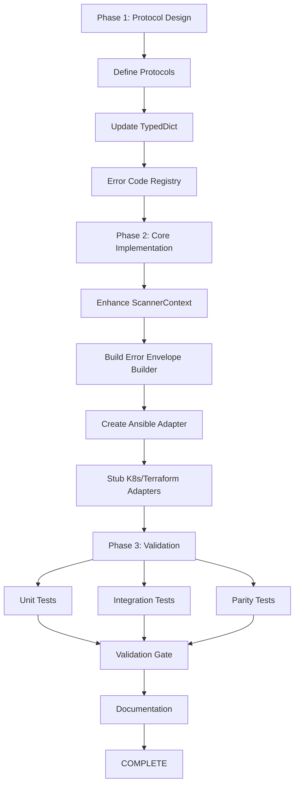

# Error Envelope Platform Extensions Implementation Plan

## Executive Summary

**Objective**: Extend `ScanErrorEntry` TypedDict to support platform-specific error handling for Kubernetes and Terraform plugins while maintaining backward compatibility with Ansible.

**Scope**: Design + Implement + Validate platform-agnostic error envelope Protocol with K8s/Terraform extensions

**Timeline**: 3-5 days (1 day design, 2-3 days implementation, 1 day validation)

**Blockers**: None (layers already decoupled, policy resolution already prepared-first)

---

## Current State (Ansible-Only Error Envelope)

### Existing Structure

```python
# src/prism/scanner_data/contracts_request.py
class ScanErrorEntry(TypedDict, total=False):
    phase: Required[str]              # "ingress", "extraction", "rendering"
    error_type: Required[str]         # "ValueError", "RuntimeError", "IOError"
    message: Required[str]            # Human-readable error message
    traceback: NotRequired[str]       # Optional stack trace
    cause: NotRequired[str]           # Optional underlying cause
```

### Usage Pattern

1. **Assembly**: `ScannerContext._record_phase_error()` creates error entries
2. **Storage**: `ScannerContext._scan_errors: list[ScanErrorEntry]`
3. **Normalization**: `prism.errors.normalize_metadata_warnings()` prepares for output
4. **Consumption**: Tests, output orchestrator, error boundary audit

### Current Limitations

- No platform-specific error codes (K8S_API_ERROR, TF_PLAN_PARSE_ERROR)
- No resource provenance (cluster, namespace, manifest path)
- No retry semantics (transient vs. permanent failures)
- No structured cause typing beyond string representation
- No secret sanitization for plugin-layer errors
- **Ansible-specific**: Task errors lack file path + line number (task names can duplicate)

---

## Target State (Multi-Platform Error Envelope)

### Design Goals

1. **Backward Compatible**: Ansible code continues working without changes
2. **Platform-Extensible**: K8s/Terraform can add structured extensions
3. **Type-Safe**: Protocol-based contracts for platform-specific fields
4. **Security-First**: Automatic secret sanitization for kubeconfig paths, tokens
5. **Actionable**: Include retry hints, resource IDs, diagnostic context

### Proposed Structure

```python
# src/prism/scanner_data/contracts_request.py (enhanced)

class ScanErrorEntry(TypedDict, total=False):
    # Core fields (existing, unchanged)
    phase: Required[str]
    error_type: Required[str]
    message: Required[str]
    traceback: NotRequired[str]
    cause: NotRequired[str]

    # NEW: Platform-agnostic extensions
    error_code: NotRequired[str]           # "K8S_API_ERROR", "TF_PLAN_PARSE_ERROR", "ANSIBLE_MODULE_NOT_FOUND"
    category: NotRequired[str]             # "runtime", "io", "parser", "api", "auth"
    recoverable: NotRequired[bool]         # True = transient, False = permanent
    resource_id: NotRequired[str]          # "namespace/pod-name", "module.resource", "role-name"
    detail: NotRequired[dict[str, Any]]    # Platform-specific structured data
    cause_type: NotRequired[str]           # Underlying exception class name
```

### Platform-Specific Detail Structures

**Kubernetes Extension**:
```python
detail: {
    "cluster": "prod-us-west",
    "namespace": "default",
    "kind": "Pod",
    "name": "nginx-7d8b49c9bd-abcde",
    "manifest_path": "/path/to/deployment.yaml",
    "api_version": "v1",
    "http_status": 404,
    "retryable": True
}
```

**Terraform Extension**:
```python
detail: {
    "provider": "aws",
    "region": "us-west-2",
    "resource_type": "aws_instance",
    "resource_name": "web_server",
    "plan_path": "/path/to/main.tf",
    "line_number": 42,
    "diagnostic_severity": "error"
}
```

**Ansible Extension** (unified with K8s/Terraform provenance):
```python
detail: {
    "module_name": "copy",
    "task_name": "Copy configuration file",
    "task_file": "tasks/main.yml",           # Relative path from role root
    "line_number": 42,                       # Task start line in file
    "task_index": 3,                         # Task position in file (0-based)
    "role_path": "/path/to/role",
    "collection": "ansible.builtin"
}
```

**Rationale for Ansible Provenance Enhancement**:
- **Problem**: Task names can be duplicated across files or within the same file
- **Solution**: Add `task_file` + `line_number` (same pattern as Terraform)
- **Benefit**: Unified diagnostic quality across all platforms
- **Implementation**: Scanner already captures this context during catalog assembly

---

## Implementation Phases

### Phase 1: Protocol Design (1 day)

**Tasks**:
1. Create `src/prism/scanner_data/error_envelope_protocol.py`
   - Define `PlatformErrorDetail` Protocol
   - Define `ErrorEnvelopeBuilder` Protocol
   - Define error code taxonomy (K8S_*, TF_*, ANSIBLE_*)

2. Update `contracts_request.py`
   - Add new optional fields to `ScanErrorEntry`
   - Maintain backward compatibility (all new fields NotRequired)

3. Create error code registry
   - `scanner_plugins/ansible/error_codes.py` (Ansible-specific codes)
   - `scanner_plugins/error_taxonomy.py` (shared code→category mapping)

**Deliverables**:
- Protocol definitions
- Updated TypedDict
- Error code registry

---

### Phase 2: Core Implementation (2 days)

**Tasks**:

**Day 1: Enhanced Error Assembly**
1. Update `scanner_core/scanner_context.py`
   - Enhance `_record_phase_error()` to accept optional extensions
   - Add `_build_error_entry()` helper for structured assembly
   - Add secret sanitization logic (strip kubeconfig paths, tokens)

2. Create `scanner_core/error_envelope_builder.py`
   - Generic builder for platform-agnostic error construction
   - Sanitization rules (regex patterns for secrets)
   - Validation logic (required fields, allowed categories)

**Day 2: Platform Plugin Adapters**
3. Create Ansible error adapter
   - `scanner_plugins/ansible/error_adapter.py`
   - Wraps Ansible module exceptions
   - Populates `detail` with unified provenance:
     - `task_file` (relative path from role root)
     - `line_number` (task start line)
     - `task_index` (position in file)
     - `module_name`, `task_name`, `role_path`, `collection`
   - Thread task context through scanner_context for error recording

4. Stub K8s/Terraform adapters (no-op for now)
   - `scanner_plugins/kubernetes/error_adapter.py` (stub)
   - `scanner_plugins/terraform/error_adapter.py` (stub)
   - Documents expected `detail` structure for future implementation

**Deliverables**:
- Enhanced `ScannerContext`
- Error envelope builder utility
- Ansible adapter (functional)
- K8s/Terraform adapters (documented stubs)

---

### Phase 3: Validation & Testing (1-2 days)

**Tasks**:

1. **Unit Tests** (`tests/test_error_envelope.py`)
   - Test basic error entry construction
   - Test platform-specific detail population
   - Test secret sanitization (kubeconfig paths, tokens)
   - Test backward compatibility (Ansible errors still work)

2. **Integration Tests** (`tests/test_scanner_context_error_envelope.py`)
   - Test error assembly during scan execution
   - Test multiple platform error entries in single scan
   - Test error normalization with new fields

3. **Parity Tests** (update `test_scanner_parity.py`)
   - Ensure source lane parity with enhanced error envelope
   - Validate optional fields don't break parity checks (use subset validation)

4. **Boundary Audit** (update `error-boundary-audit-baseline.json`)
   - Add new error adapter modules to allowlist if needed
   - Document new error wrapping patterns

**Validation Gates**:
- ✅ All existing tests pass (1306 passed / 7 skipped)
- ✅ New error envelope tests pass (20+ new test cases)
- ✅ Black formatting compliant
- ✅ Ruff lint clean (no new errors)
- ✅ Mypy type checking clean for touched files

**Deliverables**:
- 20+ new test cases
- Updated parity tests
- Updated boundary audit baseline
- Validation report

---

## Implementation Sequence



---

## Risk Assessment

| Risk | Impact | Mitigation |
|------|--------|-----------|
| Breaking parity tests | High | Use subset validation, add optional fields only |
| Secret leakage in error details | Critical | Sanitization regex + validation tests |
| Performance overhead | Medium | Lazy detail construction, optional fields |
| Type checking complexity | Low | Use Protocol, not concrete inheritance |

---

## Success Criteria

1. ✅ `ScanErrorEntry` supports platform-specific extensions
2. ✅ Ansible adapter functional with unified provenance (file + line + index)
3. ✅ K8s/Terraform adapters stubbed with documentation
4. ✅ Secret sanitization working (tested with kubeconfig paths)
5. ✅ Backward compatible (all existing Ansible scans work)
6. ✅ All validation gates green (pytest, black, ruff, mypy)
7. ✅ Documentation complete (error code taxonomy, adapter guide)
8. ✅ Provenance unification: Ansible errors as diagnostic as K8s/Terraform

---

## Follow-Up Work (Q3 Kubernetes Expansion)

When Kubernetes plugin implementation starts:
1. Implement `scanner_plugins/kubernetes/error_adapter.py` (from stub)
2. Add K8s-specific error codes to taxonomy
3. Test with live K8s clusters (API errors, resource not found, auth failures)
4. Add K8s-specific retry logic (transient vs. permanent API errors)

---

## Estimated Effort Breakdown

| Phase | Task | Hours | Notes |
|-------|------|-------|-------|
| **Phase 1** | Protocol design | 4 | Define contracts |
| | TypedDict update | 2 | Add optional fields |
| | Error code registry | 2 | Taxonomy + mapping |
| **Phase 2** | Enhance ScannerContext | 6 | Error assembly logic |
| | Error envelope builder | 4 | Sanitization + validation |
| | Ansible adapter | 4 | Detail population |
| | K8s/Terraform stubs | 2 | Documentation |
| **Phase 3** | Unit tests | 6 | 20+ test cases |
| | Integration tests | 4 | Scanner context tests |
| | Parity tests | 2 | Subset validation |
| | Documentation | 2 | Adapter guide |
| **Total** | | **38 hours** | ~5 days |

---

**Plan Owner**: Tier 2 Foreman
**Implementation Team**: Tier 1 Builders (focused implementation)
**Validation**: Tier 0 Gatekeeper (pytest + lint gates)
**Timeline**: Start 2026-05-12, Complete 2026-05-17
