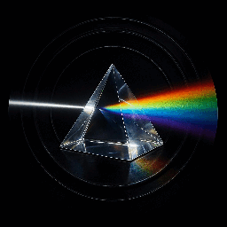

# Prism Comment Highlighter



Prism Comment Highlighter makes Prism comment-driven documentation stand out in
VS Code and gives you quick ways to hide it again when you want to focus on the
code underneath.

## Install

Install from the Visual Studio Marketplace:

1. Open the Extensions view in VS Code.
2. Search for `Prism Comment Highlighter`.
3. Select the extension and click `Install`.

You can also install from the command line:

```bash
code --install-extension Prism.prism-comment-highlighter
```

## Features

- highlights Prism markers such as `# prism~note:` and `# prism~task:`
- supports multiline Prism blocks across contiguous `#` comment lines
- offers `yellow`, `amber`, `faded`, and `custom` style modes
- can optionally color each Prism marker kind with its own default highlight
- lets you toggle highlighting on or off quickly
- provides Prism-only fold and unfold commands
- supports configurable marker prefixes such as `prism~...` or `opsdoc~...`

## Quick Start

Open a supported file such as YAML, Ansible, Python, or shell script and add
Prism documentation comments. The extension detects Prism markers automatically
and highlights the comment text after the leading `#`.

Example:

```yaml
# prism~note: verify health checks before deploy
# this line is part of the same Prism block
#
# prism~task: Restart application service | warning: confirm the change window

- name: Restart application service
  ansible.builtin.service:
    name: my-app
    state: restarted
```

Prism blocks continue across adjacent `#` comment lines until the first
non-comment line. A new `# prism~...` line starts a new Prism block.

## Commands

Use the Command Palette to run:

- `Prism Comment Docs: Toggle Enabled`
- `Prism Comment Docs: Open Settings`
- `Prism Comment Docs: Fold All`
- `Prism Comment Docs: Unfold All`

## Default Keybindings

- `Ctrl+Shift+Alt+P` or `Cmd+Shift+Alt+P` to toggle Prism highlighting on or off
- `Ctrl+Alt+]` or `Cmd+Alt+]` to fold Prism blocks
- `Ctrl+Alt+[` or `Cmd+Alt+[` to unfold Prism blocks

You can rebind any of these in VS Code's Keyboard Shortcuts UI.

## Settings

- `prismCommentDocs.enabled`
- `prismCommentDocs.markerPrefix`
- `prismCommentDocs.languageIds`
- `prismCommentDocs.markerKinds`
- `prismCommentDocs.styleMode`
- `prismCommentDocs.customColor`
- `prismCommentDocs.multicolorEnabled`
- `prismCommentDocs.multicolor.warningColor`
- `prismCommentDocs.multicolor.deprecatedColor`
- `prismCommentDocs.multicolor.noteColor`
- `prismCommentDocs.multicolor.notesColor`
- `prismCommentDocs.multicolor.additionalColor`
- `prismCommentDocs.multicolor.additionalsColor`
- `prismCommentDocs.multicolor.runbookColor`
- `prismCommentDocs.multicolor.taskColor`
- `prismCommentDocs.foldingEnabled`

`customColor` works best with hex values in the Settings UI and also accepts
manual `rgba(...)` values in `settings.json`.

Useful settings:

- set `prismCommentDocs.styleMode` to `yellow`, `amber`, `faded`, or `custom`
- set `prismCommentDocs.customColor` when using `custom` mode
- enable `prismCommentDocs.multicolorEnabled` to give each Prism marker type its own color
- adjust the `prismCommentDocs.multicolor.*Color` settings to tune specific marker kinds
- change `prismCommentDocs.markerPrefix` if your team uses `opsdoc~...`
- extend `prismCommentDocs.languageIds` to support more hash-comment languages

## Color Picker Notes

VS Code can show a color-style editor for the `customColor` setting when you
use a hex color such as `#ffd54f`. If you want more exact values like
`rgba(255, 213, 79, 0.8)`, edit the setting directly in `settings.json`.

## Troubleshooting

- reload the VS Code window if the extension was just installed
- confirm the file language is one of the configured `languageIds`
- confirm the marker prefix matches your comments, for example `prism~note`
